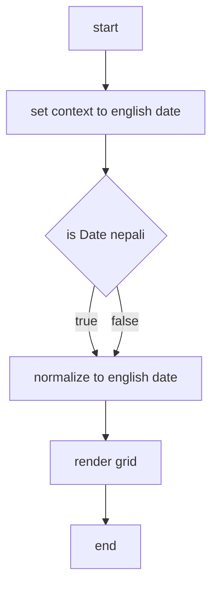
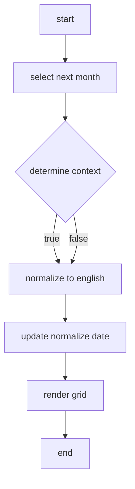

Next month selection



```
get total no of weeks in month
loop thru weeks
loop thru weekdays
get day info
	format to yyyy-mm-dd
	get first day of the month 
	normalize day (negative value, positive value, positive value more the )
	get month number
	get year
	calculate total no of days in this month 
	is normalized day less than 0 -> previous month
	if previous year update year accordingly
	is normalized day greather than 0 -> next month
	if next year update year accordingly
	determine if day is selected
	determin if day is today
	return derived values
		day
        	month
        	year
        	nepaliDay
        	nepaliMonth
        	nepaliYear
        	isCurrentMonth  // required to enable current month dates
        	isToday
        	isSelected
```